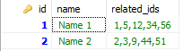
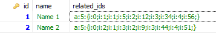

# Comma separated IDs, JSON and PHP Serialized relationships for Laravel Eloquent models

You will be able to make relations of comma separated values in your MySQL table super easely, with adding just few lines of code into your Eloquent model. 

It 

So if you use Laravel and your relations in the table looks like this, then this package is for you:




## Installation

Require package with composer

```PHP
composer require payter/has-column-many
```

## Basic usage

Using of this package is super easy - you just need to include `UseColumnMany` trait to your model.

```PHP
<?php
namespace App\Models;

use Illuminate\Database\Eloquent\Model;
use PayteR\UseColumnMany;

class ModelName extends Model
{
    use UseColumnMany;

    public function relateds()
    {
        return $this->hasColumnMany(RelatedModel::class, 'related_ids');
    }
}
```

And you can call it like any other [Eloquent relationships](https://laravel.com/docs/9.x/eloquent-relationships)

```PHP
use App\Models\ModelName;
 
$relateds = ModelName::find(1)->relateds;
 
foreach ($relateds as $related) {
    //
}
```

## Advanced usage
### Multiple columns
You are able to concat ID's even from more than one column! It's easy - just pass an array of column names as second parameter:
```PHP
return $this->hasColumnMany(RelatedModel::class, ['related_ids', 'another_column_ids']);
```

### JSON and Serialised ID's 

You don't need to do anything, it will automatically asume if it's comma separated or JSON or Serialized.

## You can 

